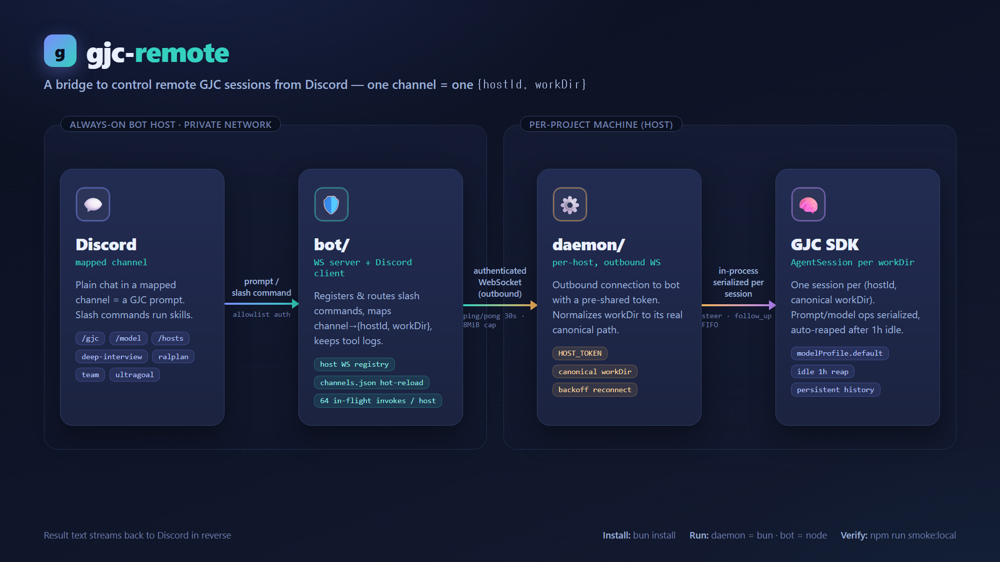

# gjc-remote

Discord-controlled remote GJC sessions.

> **⚠️ Security: this grants remote code execution.** A mapped Discord channel
> runs arbitrary GJC workflows (bash, file writes, etc.) on your host machines.
> Keep `bot/`'s WebSocket port on a private network, treat host tokens like
> passwords, and set `GJC_BOT_ALLOWED_USERS` to your own Discord user ID(s). The
> bot ships fail-closed (`GJC_REMOTE_REQUIRE_ALLOWLIST=1`) and refuses to start
> with an empty allowlist. See [SECURITY.md](SECURITY.md) before exposing it to
> anyone else.

## Architecture

[](docs/architecture.en.png)

_Diagram: [English](docs/architecture.en.png) · [한국어](docs/architecture.ko.png) — editable sources: [`docs/architecture.en.html`](docs/architecture.en.html), [`docs/architecture.ko.html`](docs/architecture.ko.html)._

```
[host machine, per project]                    [always-on bot host, private network]
  GJC embedding SDK          <--in-process-->    daemon/  --WS(outbound)-->   bot/
  (one AgentSession per                                               (WS server +
   workDir, reaped after                                               Discord client)
   1h idle)
```

1. `daemon/` runs on each machine you want to control. It connects outbound to
   `bot/`'s WebSocket server and registers with a per-host pre-shared token. The
   bot sends an application `ping` every 30 seconds and requires `pong` within
   10 seconds; half-open sockets are removed and their pending requests fail.
   A replacement connection for the same host owns its own heartbeat state.
2. On each Discord command, the daemon resolves its configured `workDir` to the
   host filesystem's current canonical real path, so retargeted symlinks or
   junctions cannot reuse a stale target. Different path spellings for the same
   directory reuse one in-process GJC SDK `AgentSession`. Prompt and model
   operations are serialized per session. Idle `steer`/`follow_up` requests join
   that FIFO and start a prompt-equivalent run instead of waiting on an inactive
   control queue. While a prompt or accepted follow-up pipeline is active,
   controls retain their SDK `steer`/`follow_up` semantics instead of waiting
   behind it. A `steer` request remains open through the current run's
   `agent_end`; each successfully queued `follow_up` remains open through its
   own run's `agent_end` and blocks queued prompt/model operations until that
   boundary. Rejected follow-up admissions consume no completion boundary. Each
   request receives its event stream, and later controls rejoin the FIFO. Idle
   sessions (no requests for 1 hour) are disposed automatically.
3. `bot/` exposes mapped-channel plain chat as direct GJC prompts, plus GJC's
   bundled skills (`deep-interview`, `ralplan`, `team`, `ultragoal`), `/gjc`,
   `/model`, and `/hosts` as Discord slash commands.
4. Each Discord channel configures one `{hostId, workDir}` input via
   `bot/channels.json`. The daemon canonicalizes `workDir`, so the effective
   session identity is `(hostId, canonical workDir)`. A host only accepts
   commands while its daemon is connected — turning the daemon off makes that
   channel's commands fail fast instead of hanging.

**Concurrency limits.** All sessions on a host share one daemon process and one
JS event loop: concurrent prompts on different workDirs interleave cooperatively
but do not run in true parallel, and a long synchronous stretch in one session
can briefly stall the others. See `CONTEXT.md` → "Concurrency model: single event
loop, and the subprocess alternative" for the full model and the subprocess
option (tracked in #33).

## Setup

```bash
bun install   # installs all workspaces (bot, daemon, shared) from bun.lock

# On the always-on bot host:
cp bot/.env.example bot/.env        # fill in DISCORD_TOKEN, DISCORD_CLIENT_ID, HOST_TOKENS, GJC_BOT_ALLOWED_USERS
cp bot/channels.example.json bot/channels.json   # map Discord channel IDs -> {hostId, workDir}
# Fill GJC_BOT_ALLOWED_USERS with your Discord user ID(s): the bot ships
# fail-closed (GJC_REMOTE_REQUIRE_ALLOWLIST=1) and refuses to start otherwise.
# Set GJC_REMOTE_REQUIRE_ALLOWLIST=0 ONLY for isolated local testing.
bun run --filter '@gjc-remote/bot' register    # publish slash commands to Discord
# Enable the Discord Developer Portal "Message Content Intent" for plain chat prompts.
bun run --filter '@gjc-remote/bot' start

# On each machine you want to control (requires Bun 1.3.14 or newer):
cp daemon/.env.example daemon/.env  # fill in HOST_ID, HOST_TOKEN (must match bot's HOST_TOKENS), BOT_WS_URL
bun run --filter '@gjc-remote/daemon' start
```

Every command above is driven by Bun (the repo's lockfile is `bun.lock`). The
daemon runs on Bun (>=1.3.14) and embeds `@gajae-code/coding-agent` **0.11.10**
(pinned in `daemon/package.json` and `bun.lock`); `bun install` provisions
exactly that version, and the interactive `gjc` used for provider login (below)
should match it. The bot, `register`, and the smoke harness run on Node via their
package scripts, so keep Node available on the bot host — or add `--bun` to
`bun run` to execute those Node scripts under Bun instead.

**Optional environment variables** — beyond the required keys above:

- **bot** — `DISCORD_GUILD_ID` registers slash commands to a single guild for
  instant propagation (global registration can take up to ~1h to appear);
  `GJC_REMOTE_DEBUG=1` logs Discord interaction lifecycle and relayed GJC event
  summaries; `CHANNELS_CONFIG` overrides the `channels.json` path.
- **daemon** — `HOST_LABEL` sets a human-readable name shown in the bot's connect
  logs; `GJC_MODEL_PROFILE` overrides the activated model profile.

## Provider authentication (e.g. GitHub Copilot)

Browser/device OAuth flows cannot be driven through the Discord bridge, so
provider auth is done once directly on each daemon host:

```bash
# On each daemon host, run interactive GJC and log in:
gjc
# then inside the session:
/login github-copilot
```

The saved token in `~/.gjc` is reused by every SDK session the daemon creates.
Once authenticated, that provider's models appear in `/model` resolution and can
be selected via exact `provider:modelId` or a unique name/ID fragment.

Each `channels.json` route must contain exactly `hostId` and `workDir`.
`hostId` must have a matching `HOST_TOKENS` entry, and `workDir` must be a
fully-qualified path native to that daemon host (for example,
`C:/projects/foo` on Windows or `/srv/apps/foo` on Linux/macOS). Relative paths
and extra route fields are rejected.

**Windows hosts:** the SDK applies fail-closed owner-only security to each
session's `<workDir>/.gjc-remote-session` storage. On Windows this can fail with
`owner_mismatch` for workDirs outside the daemon user's profile directory
(observed on `E:/` and `C:/tmp`), which aborts session creation. Configure
Windows channel workDirs under the daemon user's profile (for example
`C:/Users/<user>/projects/foo`), or verify the native ownership check before
mapping other volumes.

`/model` accepts an exact `provider:modelId` (for example,
`openai-codex:gpt-5.6-sol`) or an unqualified model ID/display-name fragment.
Unqualified input is accepted only when it has one uniquely best match;
ambiguous requests fail with a bounded candidate list instead of selecting a
provider implicitly. A successful switch reports the selected display name,
provider, and model ID. It does not change the daemon's startup default.

Each new session activates the host's configured model profile
(`~/.gjc/agent/config.yml` `modelProfile.default`) through GJC's own resolver, so
the daemon starts on the same model your interactive GJC uses instead of the
SDK's first-available fallback. Set `GJC_MODEL_PROFILE` to override the profile
name. A profile that cannot be activated (for example, missing provider
credentials) fails session creation loudly rather than silently returning empty
responses.

## Output & tool logs

GJC output reaches the channel as follows (`bot/src/delivery.js`):

- Responses up to ~1900 characters post as a single message.
- Longer output is split into sequential messages labelled `(Part i/N)`, up to
  7 parts (~600ms apart, with code fences kept intact across the split).
- Output that would exceed 7 parts posts as a short notice plus the full text as
  an in-memory `.md` file attachment — nothing is written to the bot's disk.
- Results that carry tool activity attach a button that expands the tool-call
  log on demand. Tool logs live in bot memory only: at most 100 entries, each
  expiring 1 hour after creation (`bot/src/tool-log-store.js`).

## Verification

```bash
bun run smoke:local
# Also verify model resolution and its structured success receipt:
SMOKE_MODEL_QUERY=sol bun run smoke:local   # POSIX shell
# PowerShell: $env:SMOKE_MODEL_QUERY="sol"; bun run smoke:local
```

`smoke:local` starts a local `HostRegistry`, starts a real Bun daemon, routes one
prompt through an embedded GJC SDK session, and asserts that the assistant text
comes back through the relay. When `SMOKE_MODEL_QUERY` is set, it also performs
a real model switch and requires a `model_resolved` receipt. It does not require
Discord credentials.

## Operations

### Process supervision

Neither component daemonizes itself; run each under a supervisor that restarts
on exit. Both handle `SIGINT`/`SIGTERM` gracefully, so plain signal-based stop
commands are safe:

- **bot** closes the host WS registry first (in-flight invokes settle, daemons
  observe a clean socket close), then destroys the Discord client. Each step is
  bounded by a 10s timeout, so a hung dependency cannot wedge the stop.
- **daemon** disposes its GJC SDK session pool (`pool.shutdown()`) before
  exiting; stalled sessions are bounded by the pool's own timeouts.

Examples:

```bash
# pm2 (bot host and/or daemon hosts)
pm2 start bun --name gjc-remote-bot -- run --filter '@gjc-remote/bot' start
pm2 start bun --name gjc-remote-daemon -- run --filter '@gjc-remote/daemon' start
pm2 save

# systemd (per-unit sketch; set WorkingDirectory to the repo root)
# [Service]
# WorkingDirectory=/srv/gjc-remote
# ExecStart=/usr/bin/env bun run --filter '@gjc-remote/daemon' start
# Restart=on-failure
# KillSignal=SIGTERM
# TimeoutStopSec=30
```

On native Windows daemon hosts, use a service wrapper (e.g. NSSM or a
Scheduled Task with restart-on-failure) around the same bun command. A daemon
that dies reconnects on start with equal-jitter exponential backoff, so mass
restarts do not thundering-herd the bot.

### Rotation, retention, rollback

- **Host tokens**: rotate by updating the daemon's `HOST_TOKEN` and the bot's
  matching `HOST_TOKENS` entry, then restarting both; tokens are read at
  startup only. Rotate per host if one is compromised.
- **Discord authorization** (`GJC_BOT_ALLOWED_USERS`,
  `GJC_REMOTE_REQUIRE_ALLOWLIST`): startup-only; restart the bot after changes.
- **`channels.json`**: hot-reloaded on save. An invalid reload keeps the last
  valid map (rollback is automatic); fix the file and save again.
- **Tool logs**: kept in bot memory only — at most 100 entries, each expiring
  1 hour after creation. Nothing is written to disk; no cleanup needed.
- **Session history**: each daemon workDir persists GJC session history under
  `<workDir>/.gjc-remote-session`; idle in-process sessions are disposed after
  1 hour. Delete that directory to reset a project's remote history.
- **Process logs**: both components log to stdout/stderr; retention is the
  supervisor's job (`pm2 install pm2-logrotate`, or journald's defaults).

## Security notes

- `bot/`'s WS port only needs to be reachable from daemon hosts on your
  private network — never expose it to the public internet.
- `HOST_TOKENS`/`HOST_TOKEN` are pre-shared keys; treat them like passwords.
  Rotate per host if one is compromised.
- WebSocket frames are text JSON, capped at 8 MiB on both bot and daemon,
  validated against the required v0 fields, and rejected before routing when
  malformed. Invoke message text is capped at 1 MiB to leave room for JSON
  escaping and metadata, and the bot preflights the serialized outbound frame.
  Extra object fields remain allowed for additive compatibility.
  Each host is limited to 64 concurrent in-flight invokes; beyond that the bot
  fails new requests locally instead of growing its pending map.
  The daemon and bot exchange an additive protocol version and capability list
  during registration; legacy daemons that omit them are treated as v0.
  Host tokens authenticate daemon identity but do not encrypt WebSocket
  traffic; use private `wss://`, a VPN, or a tunnel outside a single trusted
  network.
- `GJC_BOT_ALLOWED_USERS` should be set to your own Discord user ID(s) before
  inviting the bot to any shared server — an unrestricted bot lets anyone in
  the channel run arbitrary GJC workflows (file writes, bash, etc.) on your
  hosts.
  `GJC_REMOTE_REQUIRE_ALLOWLIST` ships as `1` (fail-closed): the bot refuses to
  start with an empty allowlist. Override to `0` only for isolated local
  testing, which lets anyone in a mapped channel run arbitrary GJC workflows.
  Both authorization settings are startup-only and require a bot restart after
  changes.
- Invalid `channels.json`, `HOST_TOKENS`, allowed-user entries, or strict
  allowlist flags fail before routing starts. Every mapped `hostId` must have a
  configured token. A failed `channels.json` reload keeps the last valid map.
